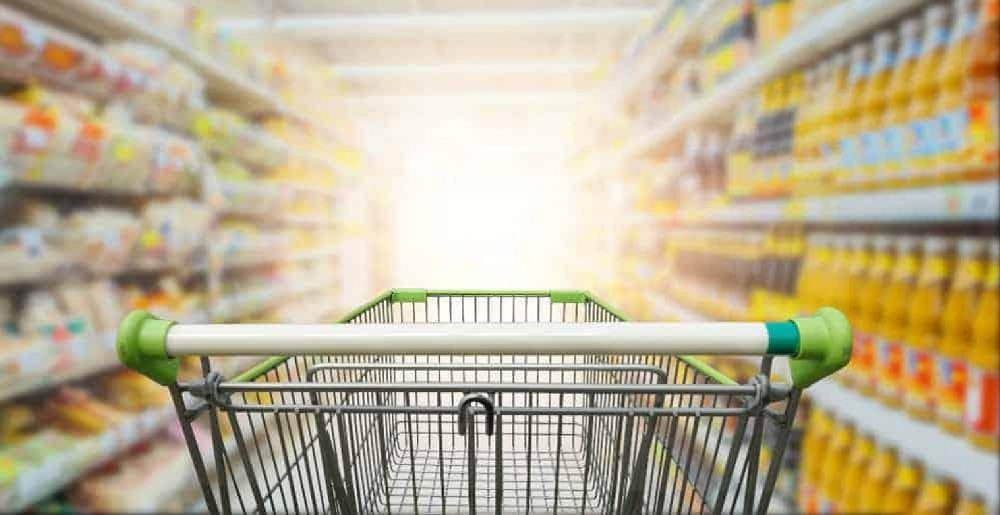
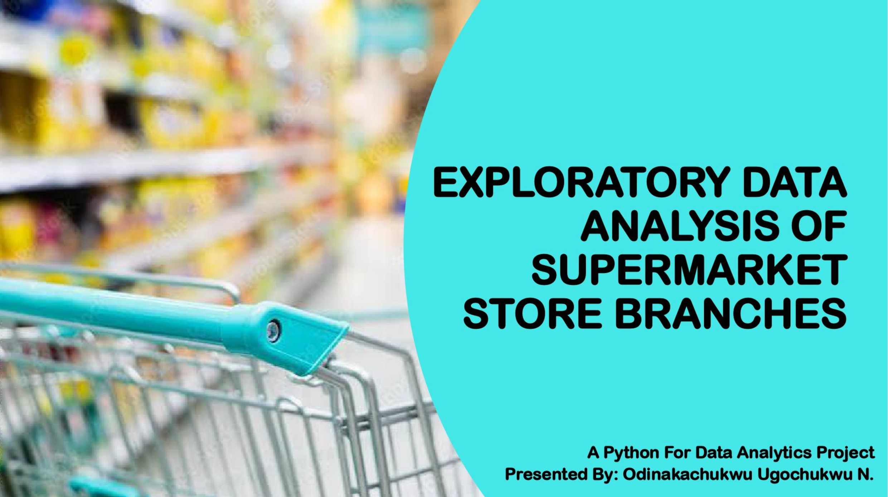

# Exploratory Data Analysis of Supermarket Store Branches

 

## Table of Contents
- [Project Overview](#project-overview)
- [Tools](#tools)
- [About Dataset](#about-dataset)
- [Supermarket Store Branches EDA In Python](#supermarket-store-branches-eda-in-python)
- [Data Analysis and Visuals in PowerPoint Presentation Slides](#data-analysis-and-visuals-in-powerpoint-presentation-slides-front-page)
- [Recommendations towards Rectifying Defects In Store Branches Sales and Making Them More Profitable](#recommendations-towards-rectifying-defects-in-store-branches-sales-and-on-making-them-more-profitable)
- [View PowerPoint Presentatation PDF](#view-powerpoint-presentatation-pdf)
 

## Project Overview
### Introduction:
   
Supermarket chains Chains have various branches located in different locations to capture different needs and tastes among customers. This project will help analyze data to enhance operations in supermarket store branches for optimal performance. Through the study, key metrics and factors affecting branch performance will be relied upon to provide actionable insights necessary for enhancing efficiency, profitability, and customer satisfaction.

### Problem Statement:
- In the competitive world of supermarket retail, it's important to make sure that each store is performing well in order to stay profitable and keep customers happy. Understanding all the different factors that can affect how well a store is doing and figuring out which ones are the most important can be tough. That's where this project comes in.
We're going to:
   - Look at trends, patterns, and things that might influence how well a store is doing in terms of sales, foot traffic, inventory turnover, and customer satisfaction.
   - Use what we learn from the data to make predictions about future performance.
   - Come up with practical ideas for ways to make things better and put them into action.

  
### Objectives:

- Identify key performance indicators (KPIs) for supermarket store branches.
- Analyze trends and patterns in branch performance metrics such as sales, foot traffic, inventory turnover, and customer satisfaction.
- Explore factors influencing branch performance, including location demographics, competition, store layout, product assortment, pricing strategies, and promotional activities.
- Develop predictive models to forecast sales, demand for specific products, and customer behavior at branch levels.
- Recommend strategies and interventions to optimize operations, enhance profitability, and improve customer experience across supermarket store branches.
 
 

### Tools:
1. Python (Was used for Data Cleaning, profilling and Exploratory Data Analysis)
   - The following Python Features were incorporated:
      1. Jupiter Notebook
      2. Numpy
      3. pandas
      4. Visualization
          - Matplotlib
          - Seaborn
          - Plotly
      5. Integration With Other tools
         
2. Microsoft PowerPoint(Was used to create analysis report presentation in slides for this project)
 
 

### Methodology (Python):
- Conduct descriptive analysis to summarize and visualize branch performance metrics, including sales trends over time, geographic distribution of customers, popular products, and peak shopping hours.
  
- Perform exploratory data analysis (EDA) to identify correlations, outliers, and patterns in the data, using techniques such as clustering, factor analysis, and association rule mining.
 

### Statistical Analysis:

- Calculate descriptive statistics, including mean, median, standard deviation, and correlation coefficients, to quantify store branches sales activity.
 

### Results and Insights:

- Provide actionable insights and recommendations for supermarket management to optimize branch operations and performance.
- Identify high-performing branches and best practices that can be replicated across the chain.
- Suggest improvements in product assortment, pricing strategies, promotional campaigns, staffing levels, and store layout to enhance customer satisfaction and loyalty.
- Propose targeted marketing strategies and personalized recommendations based on customer segmentation and behavioral patterns.
- Highlight opportunities for expansion, relocation, or consolidation of branches based on market demand, competition, and profitability.
 
 

### About Dataset:
The primary dataset used in this analysis is the "Stores.csv" file. This dataset was provided by [Quantum Analytics](https://www.quantumanalyticsco.org/). The dataset can be viewed or opened [here](Stores.csv). In the dataset, you’ll get data of different stores of a supermarket company as per their store IDs which for ease have been converted to positive integers.

| Table                              | Field                    | Description                            |            
|:-----------------------------------|:------------------------ |:-------------------------------------- |
|Stores                              | Store ID                 | (Index) ID of the particular store    |
|                                    | Store_Area               | Physical Area of the store in yard square     |
|                                    | Items_Available          | Number of different items available in the corresponding store         |
|                                    | DailyCustomerCount       | Number of customers who visited stores on average over a month         |
|                                    | Store Sales              | Sales in (US $) that stores made       |
|                                    | Category                 | Type of product         |
 

### Conclusion:
- Summarize key findings, insights, and recommendations from the data analysis project.
- Emphasize the importance of data-driven decision-making in optimizing supermarket store branch operations and achieving business objectives.
- Outline potential future research directions and areas for continuous improvement in leveraging data analytics for retail management.
 
 

## Supermarket Store Branches EDA In Python:

__Top 10 Stores With Most Item Sales__    | __Least 10 Stores With Most Item Sales__        
:----------------------------------------:|:--------------------------------------------:|
| 

__Top 10 Stores With Most Item Sales By Store Area and Daily Customer Count__                | __Least 10 Stores With Most Item Sales By Store Area and Daily Customer Count__       
:-------------------------------------------------------------------------------------------:|:----------------------------------------------------------------------------------------:|
| 

__Top 10 Stores With Most Daily Customer Count By Store Area and Item Sales__       | __Least 10 Stores With Most Daily Customer Count By Store Area and Item Sales__       
:----------------------------------------------------------------------------------:|:-------------------------------------------------------------------------------------:|
| 

__Top 10 Stores With Most Store Area By Store Sales and Daily Customer Count__       | __Least 10 Stores With Most Store Area By Store Sales and Daily Customer Count__        
:-----------------------------------------------------------------------------------:|:---------------------------------------------------------------------------------------:|
| 
 

For a complete view of the processes, codes, visuals, key insights, observations and summary of the Exploratory Data Analysis (EDA) of this project in python Jupiter Notebook, please click [here](Supermarket_Stores_Branches_Sales_Analysis_Project.ipynb)
 
 

## Analysis and Visuals in PowerPoint Presentation Slides (Front Page):

 
 

### Project Analysis:
- From the presentation, the toal revenue accrued by all the supermarket store breanches is __$53,178,770__.
- The total number of store branches is __897__.
- The total number of items in all store branches is __1,596,704__.
- Total number of daily customers that comes for shopping in all store branches is __704,570__.
- Total area of all stores (size) is __1,330,927__.
- For the top performing stores, store sizes and volume of item stock plays a slightly positive role in the number of customers that visit the stores daily and the profits they make. 
- While some of the top stores with the most daily sales have a higher daily customer count, others maintain strong sales performance with a lower customer count. indicating effective sales strategies by these stores with lower customer count but are ranked amongst the top-selling stores.
- The least-performing stores by store size and daily customer count face the challenge of attracting a substantial number of daily customers, which suggests potential room for improvement. Some stores with bigger store areas still face the challenge of weak daily customer count which affects their daily sales and which reflects a potential area for improvement.
- The top-selling stores with the most daily customer count include a combination of stores with varying store sizes which indicates an effective sales strategy and which also resulted in effectively drawing foot traffic.
- The least-selling stores with the least daily customer count indicate a challenge in customer attraction strategy. There are also stores with larger store sizes and volume of items but with a weak daily customer count which suggests mapping out an effective strategy for sales improvement.
- For a better and deeper understanding, a complete PowerPoint presentation project in PDF of this project analysis can be viewed or downloaded [here](EDA%20OF%20SUPERMARKET%20STORE%20BRANCHES%20USING%20PYTHON%20-%20ODINAKACHUKWU%20UGOCHUKWU%20NNANNA.pdf)
 
 
 

## Recommendations towards Rectifying Defects In Store Branches Sales and On Making Them More Profitable
- The Store branches that are experiencing low sales have opportunities to improve. Strategies such as targeted marketing, inventory adjustments, or operational enhancements can boost sales.
- Stakeholders may need to evaluate the allocation of resources to these stores. They should consider whether additional staff support, staff training, an upward review of staff salaries and bonuses, or improvement in marketing efforts are needed to improve the performance of these stores.
- Some of the least-performing stores exhibit low customer counts, this indicates that stakeholders need to look into potential areas for improvement in customer attraction and engagement possibly through targeted marketing, promotions, store layout enhancements, or re-organization.
- There are stores with large store sizes but with lower daily customer counts and sales output, stakeholders should look at ways of improving sales strategies, ways of optimizing sales efficiency, and ways of enhancing customer engagement.
- The stakeholders should also look for means of improving their systems and processes by leveraging technology in their store's day-to-day operations. A strong online presence in the form of good branding of the business online, digital marketing, an e-commerce store, and a platform to interact with customers through which they can analyze customer behavioral trends, understand their needs, and design a strategy for customer retention online and offline.
- All these points can improve sales immensely.
 
 

## View PowerPoint Presentatation PDF
Here’s a link to a [PowerPoint Presentation](https://github.com/Ugochukwuodinaka/Supermarket-Store-Branches-Analysis/blob/main/EDA%20OF%20SUPERMARKET%20STORE%20BRANCHES%20USING%20PYTHON%20-%20ODINAKACHUKWU%20UGOCHUKWU%20NNANNA.pdf) of this report which I created in the second phase of this project. This presentation slides displays clear visuals of this analysis.
 
 

## Thank You for Following Through!

